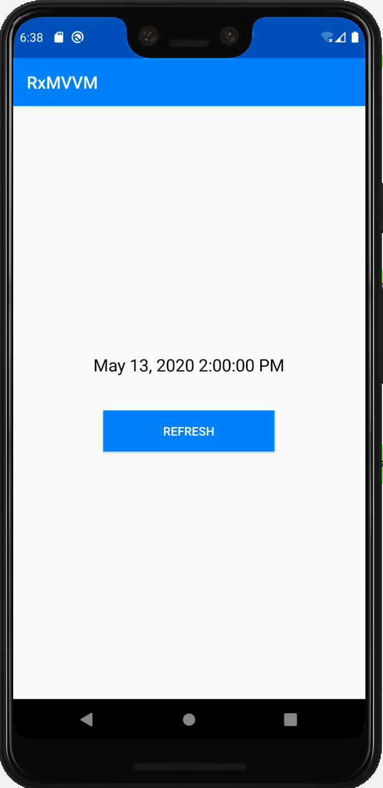

# RxMVVM
An Android Kotlin MVVM implementation with RxJava3 and Janko.

## Usage

1. New ViewModel extend RxViewModel, define service event functions
2. New Model as RxModel type, in new ViewModel
3. New UI implement UI(Janko)
4. New Activity extend RxActivity, and override abstract functions
   - appointVM(), appoint a ViewModel
   - appointUI(), appoint a UI(Janko)
   - bindViewEvent(), use view rx event to trigger ViewModel event
   - bindModelData(), use Model.obs in ViewModel to trigger View change
   - onPostBinding(), after appointXX() and bindXX() will call this function

## Sample



```kotlin
class MainActivity : RxActivity() {
    //To appoint a ViewModel
    override fun appointVM(): RxViewModel = MainVM()

    //To appoint a UI with Janko
    override fun appointUI(): UI = MainUI()

    //Bind View event to ViewModel event
    override fun bindViewEvent() {
        find<Button>(R.id.button).onClick { //View event
            vm<MainVM>().refreshTime() //ViewModel event
        }
    }

    //Bind Model to View
    override fun bindModelData() {
        vm<MainVM>().text.obs.compose(bindLifeCycle()) // Subscribe Model Observable
            .subscribe {
                find<AppCompatTextView>(R.id.text).ui { // View Change
                    text = it
                }
            }
    }

    //Do some others after two way binding
    override fun onPostBinding(savedInstanceState: Bundle?) {
        window.statusBarColor = getColor(R.color.colorPrimaryDark)
        find<Toolbar>(R.id.toolbar).ui {
            setSupportActionBar(this)
        }
        vm<MainVM>().refreshTime()
    }

}

class MainUI: UI {
    override fun createView(ctx: Context): View {
        return with(ctx) {
            LinearLayoutCompat(ctx).ui {
                orientation = LinearLayoutCompat.VERTICAL

                Toolbar(ctx).ui {
                    id = R.id.toolbar
                    title = "RxMVVM"
                    setTitleTextColor(getColor(R.color.white))
                    setBackgroundColor(getColor(R.color.colorPrimary))
                }.lparams {
                    width = matchParent
                    height = wrapContent
                }.into(this)

                LinearLayoutCompat(ctx).ui {
                    orientation = LinearLayoutCompat.VERTICAL
                    gravity = Gravity.CENTER

                    AppCompatTextView(ctx). ui {
                        id = R.id.text
                        setTextColor(getColor(R.color.black))
                        textSize = 20f
                    }.lparams {
                        width = wrapContent
                        height = wrapContent
                        bottomMargin = dip(40)
                    }.into(this)

                    Button(ctx).ui {
                        id = R.id.button
                        text = "Refresh"
                        setTextColor(getColor(R.color.white))
                        setBackgroundColor(getColor(R.color.colorPrimary))
                    }.lparams {
                        width = dip(200)
                        height = wrapContent
                    }.into(this)
                }.lparams {
                    width = wrapContent
                    height = matchParent
                    gravity = Gravity.CENTER
                }.into(this)

            }.lparams {
                width = matchParent
                height = matchParent
            }
        }
    }
}

class MainVM: RxViewModel() {
    // A sample Model
    val text = RxModel<String>()

    // A sample ViewModel event. Can be added Service Layer call or Network call.
    fun refreshTime() {
        val newText = SimpleDateFormat.getDateTimeInstance().format(Date(System.currentTimeMillis()))
        text.post(newText)
    }
}

```

## Installation
```gradle
implementation 'com.bitsecho.rxmvvm:rxmvvm-base:1.0.0'
```

## License

**RxMVVM** is under MIT license. See the [LICENSE](LICENSE) file for more info.